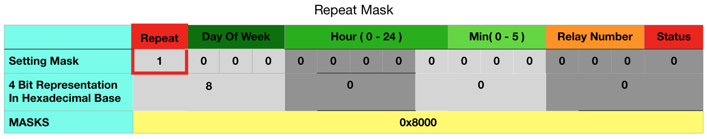

# AlarmTask Class
<br><br><br>

## O. What is AlarmTask Class ?
It is a class that contains the information about alarmed tasks in our car automation project.

### Requirement Analysis:
1) There will be **alarmed tasks** ( Activate / Deactivate this relay at this time. ).
2) Those alarms will be **weekly, repeatable** alarms. So, we just need to hold information about **day, hour, and minutes**.
3) There is no need to set alarms minute by minute. It is ok to **set alarms with the multiples of ten**.
4) It must be work with **8 channel relay module**.

### According the requirement analysis, we must hold the information about
**ID:** Unique identifier for each alarm task.  
**REPEAT:** Since it may or may not repeat, let's say 1 for repeat, 0 for non-repeat. **We need 1 bit.**
**DAY_OF_WEEK:** There are seven days in a week. **We need 3 bits to represent 7 days.**
**HOUR:** There are 24 hours in a day. **We need 5 bits to represent 24 hours.**
**MINUTE:**  According to the 3 in the requirement analysis, we just need to hold from 0 to 5. ( Minutes: **0**0, **1**0, **2**0, **3**0, **4**0, **5**0 ) **We need 3 bits.**
**RELAY_NUMBER:** There will be at most 8 relays. **We need 3 bits to represent 8 relays.**


### There are some problems that we must dealt with in the AlarmTask Class.
0) According to the Timelib.h, week starts from Sunday, but here In Turkey, week starts from Monday. 
We need to switch between these two formats. Because, RTC will be programmed in Timelib.h format.
1) There will be 8 relays. But with 3 bits, we can store the numbers from 0 to 7. 
For the sake of ease for user, he must send the number of relay, like 8, we should cast and store it as 7.

## 1. AlarmTask Implementation
### 1.1 Setting AlarmTask
2 Bytes for alarmId and 2 Bytes for alarmTask. Here, we put all the details in 2 Bytes (alarmTask). Let's see how we made it by examining the constructor of AlarmTask Class.

``` 
AlarmTask (String alarmDescription):alarmTask(0)
{
    string delimiter = " ";
    uint16_t parameters[7];

    size_t start = 0;
    size_t end = alarmDescription.find_first_of(delimiter);
    for(int i=0; i<7; i++)
    {
        parameters[i] = stoi(alarmDescription.substr(start, end-start) );

        start = end + 1;
        end = alarmDescription.find_first_of(delimiter, start);
    }

    alarmId    = parameters[0];                                   //  alarmId
    alarmTask += parameters[1] * DIGIT_VALUE_REPEAT;              //  repeat
    alarmTask += parameters[2] * DIGIT_VALUE_DAY_OF_WEEK;         //  dayOfWeek
    alarmTask += parameters[3] * DIGIT_VALUE_HOUR;                //  hour
    alarmTask += parameters[4] / 10 * DIGIT_VALUE_MINUTE;         //  minute: User can only set the alarm multiplies of ten.
    alarmTask +=(parameters[5] - 1) * DIGIT_VALUE_RELAY_NUMBER;   //  relayNumber: Relay numbers can be from 1 to 8, but we can store from 0 to 7 in 3 bits.
    alarmTask += parameters[6];                                   //  relayStatus
}
```
Here, alarmDescription is the formatted string.
//  Space is the indicator.
//  String alarmDescription = "id repeat dayOfWeek hour minute relayNumber relayStatus";
//  String alarmDescription = "1 1 1 23 50 7 1"
//  alarmId             =   1
//  repeat              =   1                (yes)
//  dayOfWeek       =   1           ( Monday, it will be casted to Timelib format. )
//  hour                =   23
//  minute              =   50          User can ONLY set the alarm with the multiplies of 10.
//  relayNumber     =   7       ( 7th relay )
//  relayStatus     =   1       ( will be activated )

After we get above information from alarmDescription string. We must multiply them with their digit value and produce the alarmTask integer ( 2 Bytes ).


### 1.2 Masks
Since we have 2 bytes long integer alarmTask, we may be able to get information from this number by applying some arithmetic and logical operations.  

#define REPEAT_MASK 0x8000
#define DAY_OF_WEEK_MASK 0x7000
#define HOUR_MASK 0x0F80
#define MINUTE_MASK 0x0070
#define RELAY_NUMBER_MASK 0x000E
#define STATUS_MASK 0x0001

<br><br><br>
<br><br><br>
<br><br><br>
<br><br><br>
<br><br><br>
<br><br><br>

#define DIGIT_VALUE_REPEAT 32768
#define DIGIT_VALUE_DAY 4096
#define DIGIT_VALUE_HOUR 128
#define DIGIT_VALUE_MINUTE 16
#define DIGIT_VALUE_RELAY_NUMBER 2

## 2. AlarmTask Example
<br><br><br>
<br><br><br>
