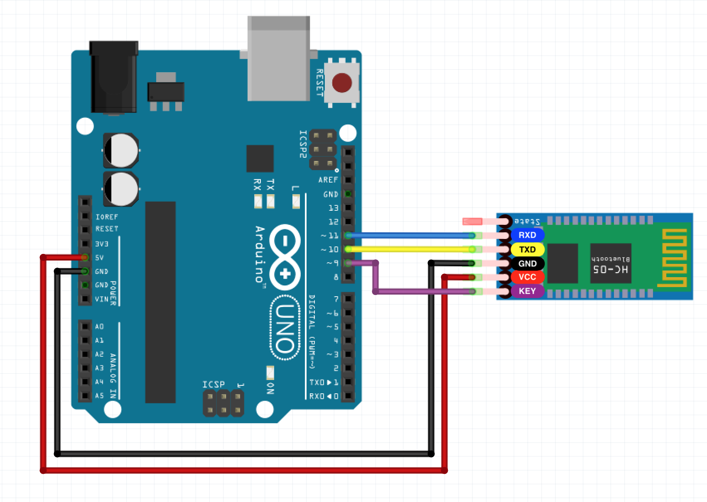
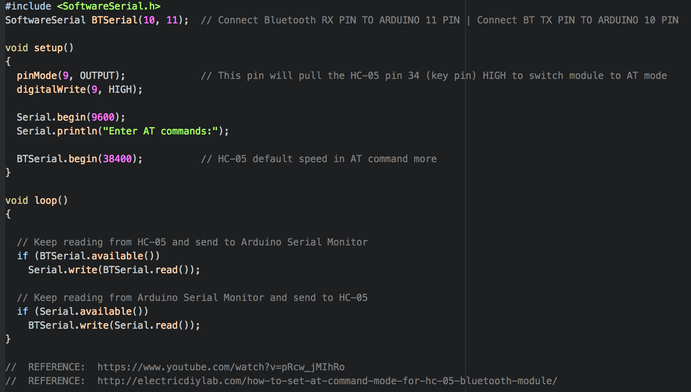
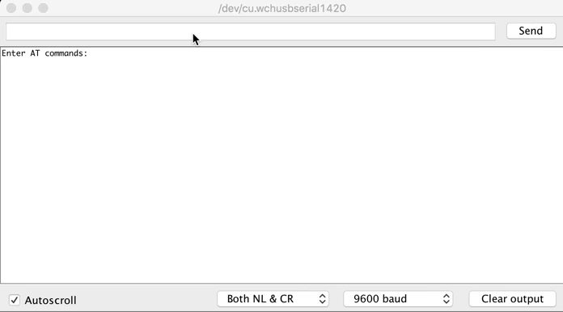

# HC-05 Bluetooth Module
We've used HC-05 Bluetooth Module in order to connect Arduino to Android via Bluetooth. 
But, since HC-05 comes with default values like password, we need to configure it as we want. 

## O. Wire Connections Between Arduino and HC-05
Be careful about not to connect Bluetooth RX, TX pins to the Arduino RX, TX pins directly. 
Because, we want to configure HC-05 by using Serial Monitor and it can only be opened if the USB cable is connected. 
But USB cable and RX,TX pins both are on the same port.  
There will be conflict if you connect Bluetooth RX, TX pins to Arduino RX, TX pins **when the USB cable is connected.** 
> It communicates on digital pins 0 (RX) and 1 (TX) as well as with the computer via USB.
> - https://www.arduino.cc/reference/en/language/functions/communication/serial/

  
You see the solution below, connect Bluetooth RX, TX pins to any of the Arduino's pins except for Arduino RX, TX. 
In our case, those pins are 10 and 11. They will be set as RX, TX in the software. 

   

## 1. AT Mode Example
   

## 2. AT Mode Example Output
   

REFERENCES: https://image.online-convert.com/
