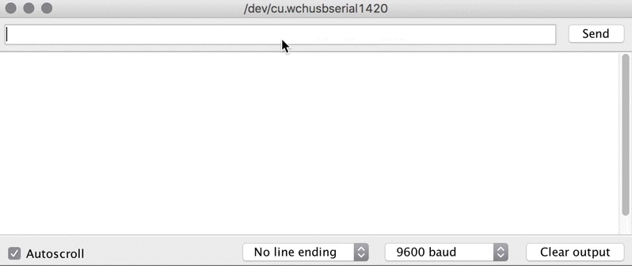
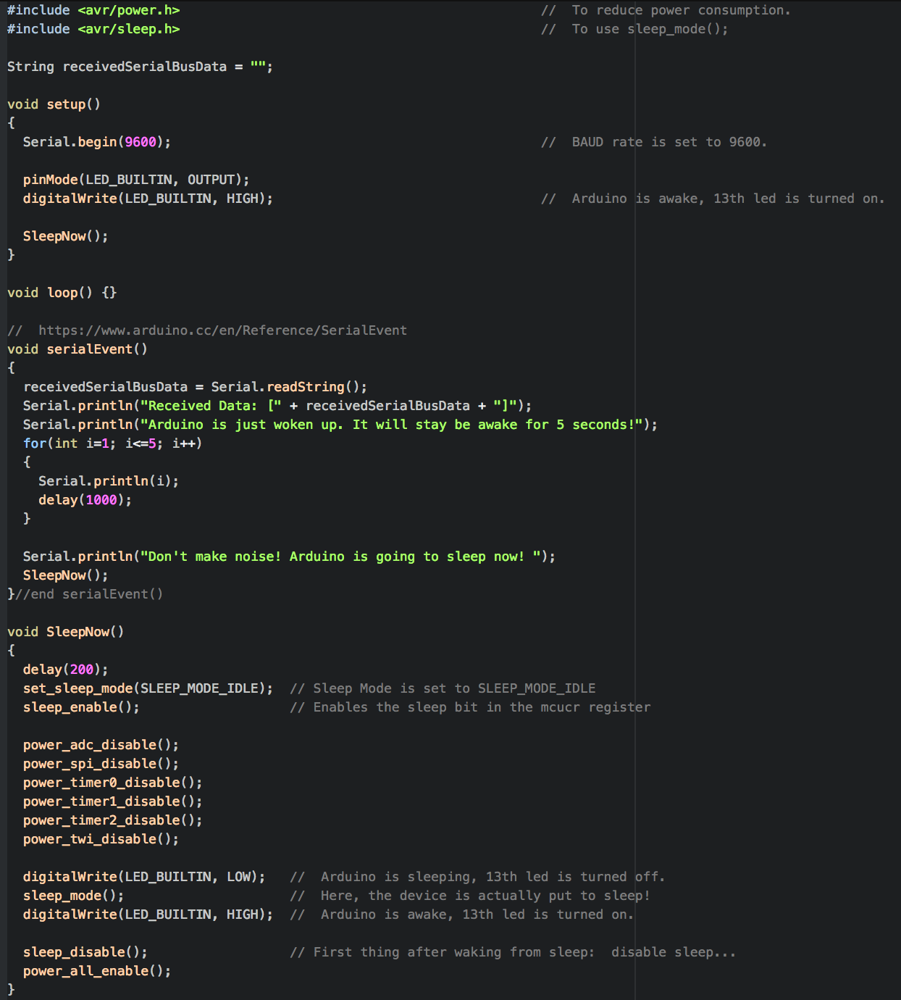

# Arduino Sleep Idle Mode
> Events on the USART (the serial port) will also wake up the Arduino. In order for this to work, the Arduino must be in POWER_MODE_IDLE, the only power mode that doesn't disable the USART.
>- https://playground.arduino.cc/Learning/arduinoSleepCode

   

## O. Arduino Sleep Idle Mode Example
   

REFERENCE: https://playground.arduino.cc/Learning/arduinoSleepCode
REFERENCE: https://www.nongnu.org/avr-libc/user-manual/modules.html
REFERENCE: https://www.nongnu.org/avr-libc/user-manual/group__avr__sleep.html
REFERENCE: https://www.nongnu.org/avr-libc/user-manual/group__avr__power.html
