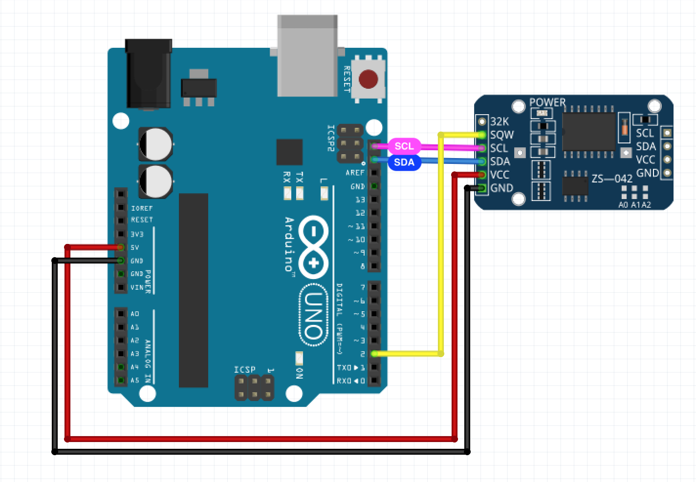
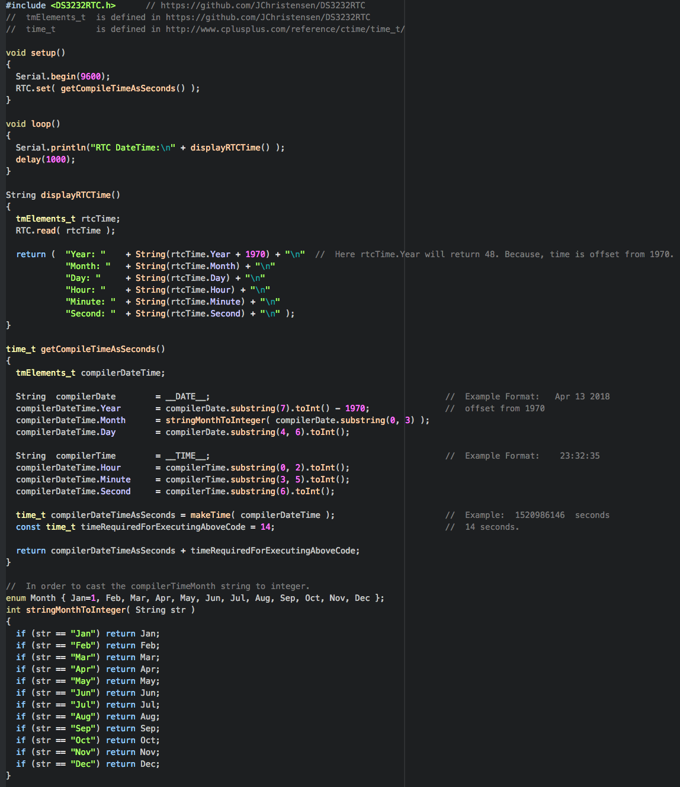
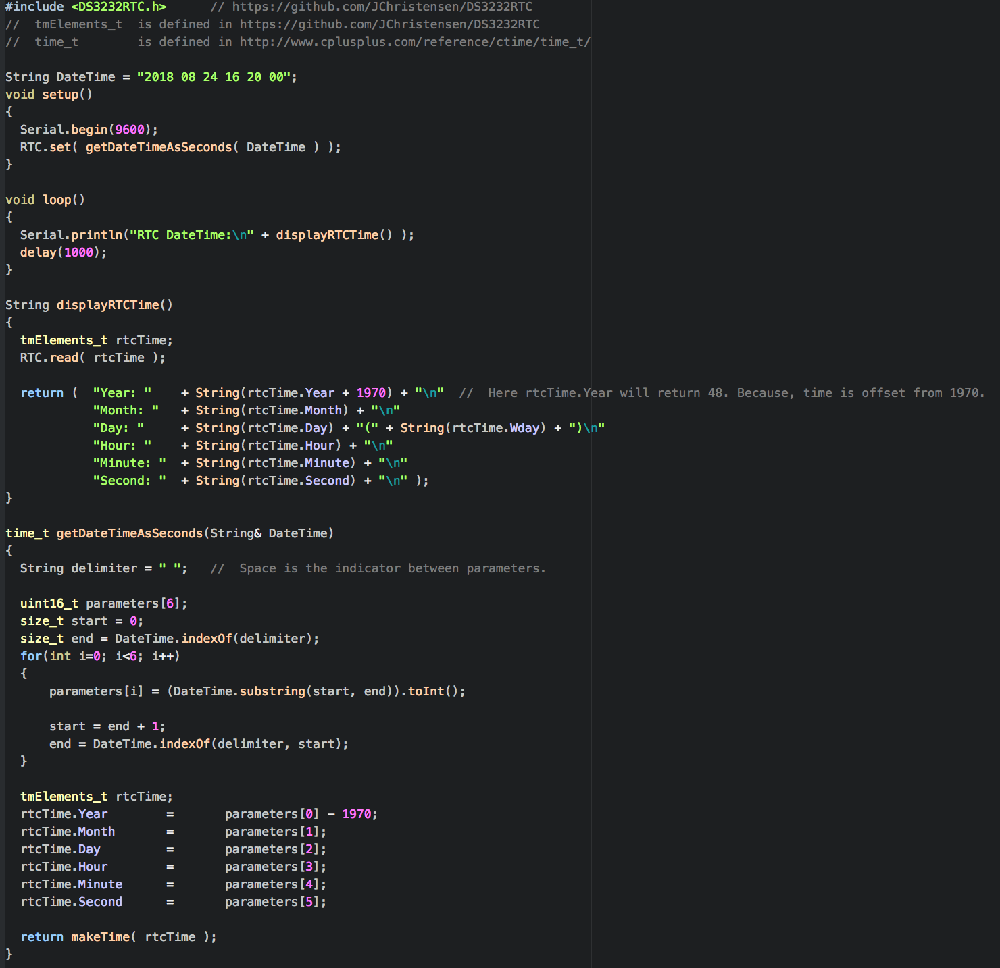
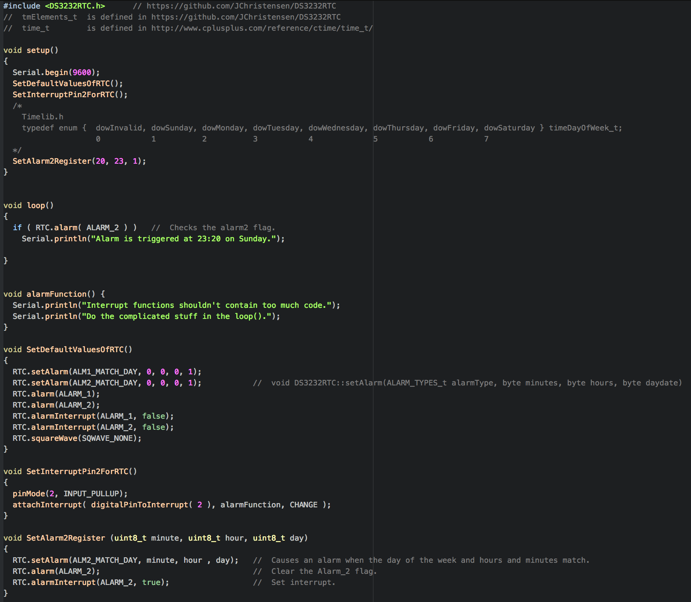

# Arduino and Real Time Clock
> The RTC maintains seconds, minutes, hours, day, date, month, and year information.
>- https://datasheets.maximintegrated.com/en/ds/DS3232.pdf
 

   

## O. Setting Compiling Time To RTC
   

## 1. Setting And Getting RTC Time
   

## 2. Getting Interrupt From RTC
Here, we used the alarm which is triggered when the specified **day, hour and minute match.**  
You should also examine the **Timelib.h**.
   

REFERENCES: https://github.com/JChristensen/DS3232RTC
