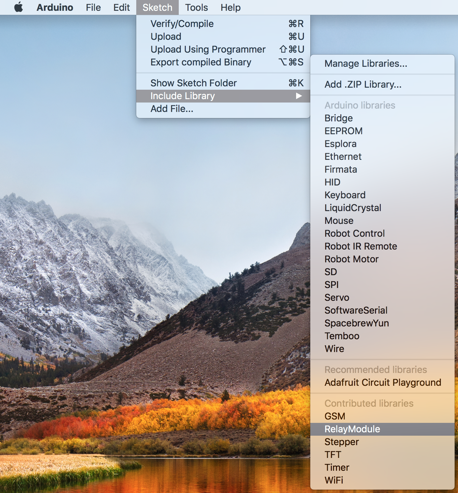
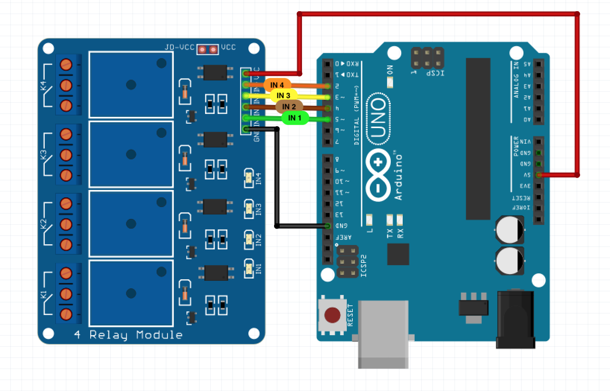

# RelayModule Library for Arduino
## O. What is RelayModule Library? If I use it, how easier life will be ?
If you have made some Arduino project with Relay Modules, you probably wrote some **scattered code** for relays. 

**Scattered Code Example 1:** You should initalize all the pins and modes for each relay. 

    //Those below codes will help you to see how bad and untidy the code looks.
    int Relay1 = 5;
    int Relay2 = 4;
    int Relay3 = 3;
    int Relay4 = 2;
    pinMode(Relay1, "OUTPUT");
    pinMode(Relay2, "OUTPUT");
    pinMode(Relay3, "OUTPUT");
    pinMode(Relay4, "OUTPUT");
**Scattered Code Example 2:** You should know *logic type* of the Relay Module. 
**"When a relay is activated?"** question will give the answer about *logic type.* 
If a relay is activated with `digitalWrite(pin, LOW)`, that means Relay Module is working with **LOW** logic. 

    //As an example, if you want to activate all relays on the Relay Module, you should write:
    digitalWrite(Relay1, LOW);
    digitalWrite(Relay2, LOW);
    digitalWrite(Relay3, LOW);
    digitalWrite(Relay4, LOW);
**Scattered Code Example 3:**  
What if you have 8 Relay Module, you must do all the above stuffs for each relay. 
What if you are working with more than one Relay Module, how many relay numbers will be waiting you to initalize them? 
The more relay you have, the more scattered your source code will be.  

## If I use it, how easier life will be ?
RelayModule Library will help you to write **neat code** for relay modules. 
It will reduce the confusion and enhance the code readability . 
You can create RelayModule instance in your Arduino source code, and **initalize each relay easily.** 
Without thinking about "**Should I write LOW or HIGH to activate it?**", you will make relays activate or deactivate easily. 
 
 
## 1. Adding RelayModule Library to the Arduino Libraries Folder
After downloading RelayModule folder, you should place it to the **libraries** folder which should be located in the Arduino folder.
 
 
For me, this libraries folder is located in:  
**/Users/safakakinci/Documents/Arduino/libraries/RelayModule**  
   
   
## 2. Importing RelayModule Library to the Arduino Project Source Code
On the menu bar, you are going to see **Include Library** which is located under the **Sketch** tab. 
Click **RelayModule** which is at the bottom of **Include Library** pane. 

   

After clicking it, those two lines below automatically will be added to the source code. 
   

## 3. How to use RelayModule Library ?
### 3.1 Creating RelayModule Instance
`RelayModule module(4, "LOW");` 
We have specified that there are **4 relays** on this Relay Module and it is working with **LOW** logic. 
Working with **LOW logic** specifies that **relays will be activated** when `digitalWrite(pin, LOW)` is executed. 
 
### 3.2 Setting Pins and Modes of Relays
**module** which we have created above(3.1) has 4 relays. We should set pin number and pin mode for each relay. 
As an example, look at the figure below! **Arduino Uno and 4 Relay Module are connected.** 
 
 
If we have those connections, we need to set the Relay Module's pins as: 
`module[1].setPin(5).setPinMode("OUTPUT")` &nbsp;&nbsp;&nbsp;&nbsp;1st relay **(IN1)** is connected to the Arduino's **Digital5** pin. The green wire. 
`module[2].setPin(4).setPinMode("OUTPUT")` &nbsp;&nbsp;&nbsp;&nbsp;2nd relay **(IN2)** is connected to the Arduino's **Digital4** pin. The blue wire. 
`module[3].setPin(3).setPinMode("OUTPUT")` &nbsp;&nbsp;&nbsp;&nbsp;3rd relay **(IN3)** is connected to the Arduino's **Digital3** pin. The yellow wire. 
`module[4].setPin(2).setPinMode("OUTPUT")` &nbsp;&nbsp;&nbsp;&nbsp;4th relay **(IN4)** is connected to the Arduino's **Digital2** pin. The red wire. 

`module[1].setPin(5).setPinMode("OUTPUT");`  
**module[1]** specifies the module's first relay. (Be careful not try to reach first relay with **module[0]** ) 
**setPin(5)** specifies that relay is connected with Arduino's **Digital5** pin. 
**setPinMode("OUTPUT")** specifies that Arduino's **Digital5** pin will be used in **OUTPUT** mode. 
 

### 3.3 All Functions of RelayModule

<table>
    <tr>
        <th width=30%><b>Functions</b></th>
        <th width=40%><b>Explanation</b></th>
        <th><b>Example</b></th>
    </tr>
    <tr>
        <td> module( relayNumber, lowOrHigh ); </td>
        <td> Initiates the relay module. </td>
        <td> module( 4 , LOW ); Activates the fourth relay. </td>
    </tr>
    <tr>
        <td> module.active( relayNumber ); </td>
        <td> Activates the relay.</td>
        <td> module.active(4); Activates the fourth relay. </td>
    </tr>
    <tr>
        <td> module.activeAll(); </td>
        <td> Activates all relays on the Relay Module.</td>
    </tr>
    <tr>
        <td> module.deactive( relayNumber ); </td>
        <td> Deactivates the relay.</td>
        <td> module.active(1); Deativates the first relay. </td>
    </tr>
    <tr>
        <td> module.deactiveAll(); </td>
        <td> Deactivates all relays on the Relay Module. </td>
    </tr>
    <tr>
        <td> module.getStatus(); </td>
        <td> Returns the status of relays as integer type. </td>
        <td> Status: 7   7 = 0 + 4 + 2 + 1   Specifies that Relay 1,2, 3 are active and Relay4 is deactive. </td>
    </tr>
    
</table>
